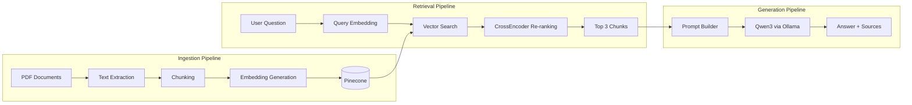
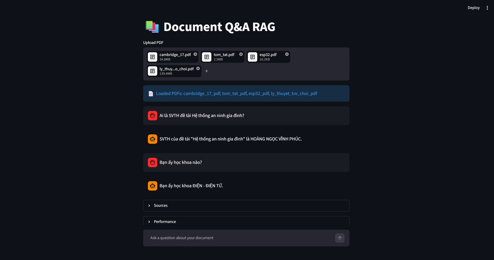

# Document Q&A RAG System

## Overview

This project is a Retrieval-Augmented Generation (RAG) system that allows users to upload multiple PDF documents and ask questions based on their content.

The system combines semantic retrieval, re-ranking, and local large language models to generate grounded answers from uploaded documents.

### Main Capabilities

- PDF document ingestion
- Text chunking and embedding generation
- Semantic retrieval using Pinecone
- Re-ranking with CrossEncoder
- Answer generation using a local LLM (Qwen3 via Ollama)
- Multi-document support
- Source attribution
- Real-time chat interface

---

## Features

- Upload and index multiple PDF documents
- Semantic search using multilingual embeddings
- Vector database integration with Pinecone
- Re-ranking for improved retrieval accuracy
- Local LLM inference using Ollama
- Conversational memory support
- Source tracking at chunk level
- Streaming responses
- Performance monitoring

---

## System Architecture



## Tech Stack

| Component | Technology |
|------------|------------|
| Frontend | Streamlit |
| PDF Processing | PyMuPDF |
| Embedding Model | multilingual-e5-base |
| Re-ranking Model | CrossEncoder (ms-marco-MiniLM) |
| Vector Database | Pinecone |
| LLM | Qwen3:8B |
| LLM Runtime | Ollama |
| Language | Python |

---

## Installation

Clone the repository:

```bash
git clone https://github.com/hnvp/document_qa_rag
cd document_qa_rag
```

Install dependencies:

```bash
pip install -r requirements.txt
```

---

## Install Ollama

Pull the model:

```bash
ollama pull qwen3:8b
```

Start Ollama:

```bash
ollama serve
```

---

## Run the Application

```bash
streamlit run app.py
```

---

## Screenshots


